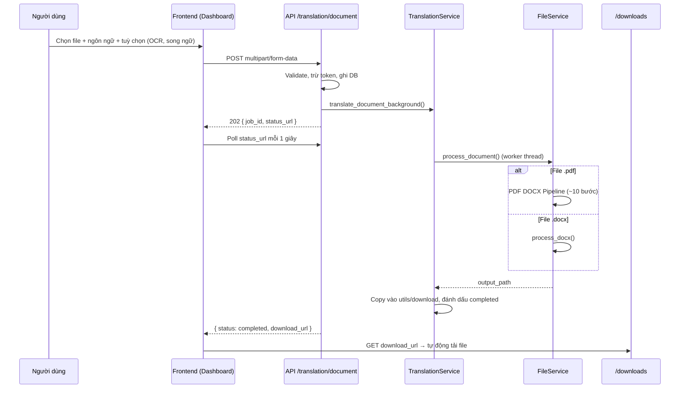

# Quy Trình Hoạt Động — Dịch File

Tài liệu mô tả **luồng xử lý chính** của chức năng dịch tài liệu (PDF / DOCX) trong hệ thống hiện tại, cùng **ưu và nhược điểm** so với các dịch vụ dịch file phổ biến trên thị trường.

---

## 1. Phạm vi

| Hạng mục | Giá trị |
|---|---|
| Loại file hỗ trợ (luồng chính) | `.pdf`, `.docx` |
| Endpoint upload | `POST /api/translation/document` |
| Endpoint theo dõi tiến trình | `GET /api/translation/document/status/{job_id}` |
| Endpoint tải kết quả | `GET /downloads/{filename}` |
| Kiểu xử lý | Bất đồng bộ (background job + polling) |
| Pipeline PDF | **Chỉ** `PDF → DOCX → dịch → PDF` (`pdf_docx_pipeline`) |
| Nhà cung cấp dịch | Google Translate, DeepL, Gemini (tuỳ chọn trên Dashboard) |

---

## 2. Sơ đồ luồng tổng quan



---

## 3. Bước 1 — Người dùng upload (Frontend)

**Vị trí code:** `frontend/pages/dashboard.html`, `frontend/js/dashboard.js`

1. Người dùng chọn file PDF hoặc DOCX trên Dashboard.
2. Chọn ngôn ngữ đích.
3. (Tuỳ chọn) Bật OCR ảnh nhúng, chế độ song ngữ, nhà cung cấp dịch.
4. Frontend gửi `POST /api/translation/document`.

**Các trường FormData chính:**

| Trường | Bắt buộc | Mô tả |
|---|---|---|
| `file` | Có | File `.pdf` hoặc `.docx` |
| `target_lang` | Có | Mã ngôn ngữ đích |
| `translation_provider` | Không | `google`, `deepl`, hoặc `gemini` |
| `ocr_images` | Không | `"1"` nếu bật OCR ảnh nhúng |
| `ocr_mode` | Không | `image`, `text`, `both`, `auto` |
| `bilingual_mode` | Không | Xem mục 8 |
| `bilingual_delimiter` | Không | Dấu phân cách song ngữ liền kề (mặc định `\|`) |

**Chế độ song ngữ (`bilingual_mode`):**

| Giá trị gửi lên | Tên hiển thị | Hành vi |
|---|---|---|
| `none` (mặc định) | Dịch thường | Chỉ giữ bản dịch, thay thế nội dung gốc |
| `preserve_layout` | Song ngữ liền kề | `Gốc \| Dịch` trong cùng đoạn |
| `line_by_line` | Song ngữ xuống dòng | Giữ đoạn gốc, chèn đoạn dịch ngay bên dưới |

5. Nếu API trả `202` kèm `job_id`, frontend poll `status_url` mỗi **1 giây** và cập nhật thanh tiến trình theo `progress` / `message`.

---

## 4. Bước 2 — API nhận request

**Vị trí code:** `api_base/app/routers/translation.py`

1. Validate file và `target_lang`.
2. Lưu file vào `api_base/app/uploads/`.
3. Ước lượng token theo kích thước file.
4. Kiểm tra và trừ token (người dùng đăng nhập).
5. Ghi bản ghi `Translation` vào database.
6. Khởi tạo background job qua `TranslationService.translate_document_background(...)`.
7. Trả `202 Accepted` kèm `job_id` và `status_url`.

---

## 5. Bước 3 — Background worker

**Vị trí code:** `api_base/app/services/translation_service.py`

Worker chạy trên **thread riêng**, quản lý job trong RAM (`self.jobs[job_id]`):

| Trường job | Ý nghĩa |
|---|---|
| `status` | `pending` → `in_progress` → `completed` / `failed` |
| `progress` | 0–100 |
| `message` | Mô tả bước đang chạy |
| `download_url` | URL tải file khi hoàn tất |
| `error` | Chi tiết lỗi (nếu failed) |
| `fallback` | `true` nếu đuôi file output khác input |

**Các bước worker:**

1. Gán nhà cung cấp dịch theo request.
2. Khởi tạo COM trên Windows (phục vụ DOCX→PDF qua Word).
3. Gọi `FileService.process_document(...)` với callback tiến trình.
4. Chuẩn hoá output về `api_base/utils/download/`.
5. Đánh dấu `completed` hoặc `failed`.

---

## 6. Bước 4 — Điều phối xử lý file

**Vị trí code:** `api_base/app/services/file_service.py`

```
process_document(file_path, target_lang)
├── .pdf  → pdf_service.process_pdf()     → run_pdf_docx_pipeline()
└── .docx → docx_service.process_docx()   → Dịch trực tiếp DOCX
```

Mọi đoạn văn bản cần dịch đi qua `_translate_with_retry()` với retry, backoff, cache và xử lý rate-limit.

---

## 7. Luồng PDF — Pipeline DOCX (mặc định)

**Vị trí code:**

- `api_base/app/services/pdf_service.py`
- `api_base/app/services/document_v2/pdf_docx_pipeline/pipeline.py`
- `api_base/app/services/document_v2/pdf_docx_pipeline/layout_recovery.py`

### 7.1. Sơ đồ các bước

```
PDF gốc
  │
  ├─► [1] PDF Analyzer          — scan/text layer, bảng, cột, ảnh
  │
  ├─► [2] Scan OCR (nếu cần)    — Tesseract → searchable PDF
  │
  ├─► [3] PDF Cleaner           — xoay, deskew, enhance, làm sạch layer
  │
  ├─► [4] PDF → DOCX            — pdf2docx (hoặc Word/Adobe nếu cấu hình)
  │
  ├─► [5] Sanitize DOCX         — gỡ noise, gộp fragment, chuẩn hoá lề/căn dòng
  │         (trước khi dịch)
  │
  ├─► [6] DOCX Translation      — process_docx(from_pdf=True)
  │         • batch dịch theo đoạn
  │         • Translation Guard (URL, DOI, công thức…)
  │         • chế độ song ngữ (nếu bật)
  │
  ├─► [7] DOCX Layout Recovery  — đồng bộ layout từ DOCX gốc sang DOCX dịch
  │         • dịch thường: regional profile (title/abstract/body)
  │         • song ngữ xuống dòng: ghép cặp gốc–dịch, mirror indent + font
  │         • song ngữ liền kề: giữ text, sync style cơ bản
  │
  ├─► [8] Final layout pass     — chỉ với dịch thường (bilingual_mode=none)
  │
  ├─► [9] DOCX → PDF            — docx2pdf (Windows/Word) hoặc LibreOffice
  │
  └─► [10] Quality Checker      — kiểm tra mất chữ/bảng/reference
```

### 7.2. Bảng tóm tắt từng bước

| # | Bước | Mục đích |
|---|---|---|
| 1 | PDF Analyzer | Quyết định có cần Scan OCR, ghi nhận đặc điểm layout |
| 2 | Scan OCR | PDF scan → PDF có lớp text (Tesseract) |
| 3 | PDF Cleaner | Chuẩn hoá hình ảnh/trang trước khi chuyển DOCX |
| 4 | PDF → DOCX | Chuyển cấu trúc sang Word để dịch từng đoạn |
| 5 | Sanitize DOCX | Gỡ artifact pdf2docx, gộp dòng affiliation/email/abstract bị cắt, chuẩn lề |
| 6 | DOCX Translation | Dịch nội dung, giữ run/style/bảng; hỗ trợ song ngữ |
| 7 | Layout Recovery | Khôi phục căn lề, thụt dòng, bảng, ảnh sau dịch |
| 8 | Final layout | Pass cuối cho template học thuật (Springer-style) khi dịch thường |
| 9 | DOCX → PDF | Xuất lại PDF |
| 10 | Quality Checker | Cảnh báo mất nội dung cấu trúc |

### 7.3. Xử lý layout theo chế độ dịch

| Chế độ | Sau dịch | Layout recovery |
|---|---|---|
| Dịch thường | Chỉ bản dịch | Regional profile đầy đủ + pass cuối trước xuất PDF |
| Song ngữ liền kề | `EN \| VI` cùng dòng | Sync style; **không** chạy lại regional toàn văn bản (tránh phá text) |
| Song ngữ xuống dòng | EN rồi VI xuống dòng | Ghép cặp theo nội dung; mirror indent + cỡ chữ; abstract/body justify riêng |

**Kết quả:** File PDF đã dịch tại `api_base/utils/download/translated_*.pdf`.

---

## 8. Luồng DOCX — Dịch trực tiếp

**Vị trí code:** `api_base/app/services/docx_service.py` → `process_docx()`

1. Mở file DOCX (xử lý `.docm` nếu cần).
2. Duyệt và dịch: body → bảng → header/footer.
3. **Batch pre-translation:** gom nhiều đoạn, dịch một lần qua separator `<<<S>>>` để giảm số lần gọi API.
4. **Translation Guard:** bỏ qua URL, DOI, reference, công thức, code.
5. **Chế độ song ngữ:** inline hoặc xuống dòng (như mục 3).
6. **OCR ảnh nhúng** (tuỳ chọn): Tesseract trên ảnh trong DOCX.
7. Targeted fixes: hyperlink, tab leader, bảng, ảnh.
8. Lưu `translated_*.docx` vào `utils/download/`.

> Upload DOCX **không** chạy pipeline PDF; layout recovery của PDF chỉ áp dụng khi `from_pdf=True`.

---

## 9. Cơ chế dịch văn bản

**Vị trí code:** `api_base/app/services/translation_service.py`

1. Kiểm tra skip (đã đúng ngôn ngữ, email/URL thuần…).
2. Chọn provider: DeepL / Gemini / Google Translate.
3. Context prompt theo loại: `document_docx_line`, `document_docx_batch`, `document_pdf`.
4. Retry + cache trong RAM qua `FileService._translate_with_retry()`.

---

## 10. Frontend poll và tải kết quả

**Poll:** `GET /api/translation/document/status/{job_id}` mỗi 1 giây.

**Hoàn tất:** Frontend tự tải qua `download_url` → `GET /downloads/<filename>`.

Với PDF nhiều trang, `message` dạng `PDF: page X/Y` hoặc `Translating paragraph X/Y` giúp tránh hiển thị 100% sớm.

---

## 11. Cấu hình môi trường liên quan

Tham khảo `api_base/.env.example`:

```env
# PDF → DOCX → dịch → PDF
PDF_DOCX_CONVERTER=pdf2docx
PDF_DOCX_EXPORT_ENGINE=auto

# Chế độ layout: auto | academic | conservative
# auto = tự nhận bài báo khoa học vs PDF thường (hóa đơn, báo cáo, thư...)
# academic = ép template Springer/journal (chỉ dùng khi chắc chắn là bài báo)
# conservative = giữ layout gốc từ pdf2docx, không áp profile vùng abstract/body
PDF_DOCX_LAYOUT_MODE=auto

# Làm sạch + layout trước/sau dịch
PDF_DOCX_STRIP_NOISE=1
PDF_DOCX_SANITIZE_MERGE_FRAGMENTS=1
PDF_DOCX_NORMALIZE_ALIGN=1
PDF_DOCX_NORMALIZE_INDENTS=1
PDF_DOCX_REGIONAL_LAYOUT=1
PDF_DOCX_LAYOUT_SYNC=1
PDF_DOCX_PDF_GEOMETRY_PROFILE=1

# Dịch DOCX
DOCX_TRANSLATION_GUARD=1
DOCX_BATCH_CHAR_LIMIT=3000
AI_MAX_TOKENS_DOCX_BATCH=4096
```

**Gợi ý cấu hình theo loại file:**

| Loại PDF | `PDF_DOCX_LAYOUT_MODE` | Ghi chú |
|---|---|---|
| Bài báo Springer/IEEE | `auto` hoặc `academic` | Bật `REGIONAL_LAYOUT`, merge fragment |
| Hóa đơn, báo cáo, thư, form | `auto` (mặc định) hoặc `conservative` | `auto` tự chọn conservative nếu không có abstract/keywords |
| PDF nhiều cột | `conservative` | `auto` cũng chuyển conservative khi phát hiện multi-column |

Khi pipeline chạy, log progress sẽ hiện `Layout mode: academic (journal template)` hoặc `Layout mode: conservative (preserve source layout)`.

---

## 12. Trạng thái job và lỗi HTTP

| Trạng thái | Ý nghĩa |
|---|---|
| `pending` | Job đã tạo, chờ worker |
| `in_progress` | Đang xử lý |
| `completed` | Có thể tải qua `download_url` |
| `failed` | Xem trường `error` |

| Mã HTTP | Nguyên nhân |
|---|---|
| `400` | Thiếu file / ngôn ngữ / sai định dạng |
| `402` | Không đủ token |
| `404` | Job không tồn tại (restart server, job hết hạn RAM) |
| `500` | Không khởi tạo được job |
| `503` | Dịch vụ dịch / OCR không sẵn sàng |

---

## 13. Lưu ý vận hành

- Job lưu trong **RAM** — restart server mất trạng thái job đang chạy.
- Upload **PDF** → output **PDF**; upload **DOCX** → output **DOCX**.
- PDF scan cần **Tesseract** (`TESSERACT_CMD`, `OCR_LANGS_DEFAULT`).
- DOCX→PDF trên Windows ưu tiên **Microsoft Word**; Linux/Docker dùng **LibreOffice**.
- Template học thuật (Springer, abstract hẹp, thụt đầu dòng body) được tối ưu cho pipeline PDF; file Word tự thiết kế phức tạp có thể cần chỉnh tay sau dịch.

---

## 14. Tóm tắt đường đi theo loại file

### Upload PDF

```
Dashboard → POST /document → Background Job
  → Analyze → [OCR scan] → Clean → PDF→DOCX → Sanitize
  → Dịch DOCX → Layout Recovery → [Final layout] → DOCX→PDF → Quality Check
  → utils/download/translated_*.pdf → Poll → Tải file
```

### Upload DOCX

```
Dashboard → POST /document → Background Job
  → process_docx (batch dịch, guard, song ngữ, OCR ảnh tuỳ chọn)
  → utils/download/translated_*.docx → Poll → Tải file
```

---

## 15. So sánh với các dịch vụ dịch file trên thị trường

Bảng dưới so sánh **chức năng dịch file** của hệ thống này với các nền tảng phổ biến: **DeepL Document**, **Google Translate (tài liệu)**, **Adobe Acrobat Translate**, **Microsoft Translator (document)**, **ChatGPT / Claude (upload file)**, và các công cụ online (Smallpdf, DocTranslator…).

### 15.1. Bảng tổng quan

| Tiêu chí | Hệ thống này | DeepL / Google Doc | Adobe Acrobat | ChatGPT / Claude upload |
|---|---|---|---|---|
| Giữ layout PDF phức tạp | Khá tốt (pipeline DOCX + layout recovery) | Tốt–Khá | Rất tốt (commercial) | Kém–Trung bình |
| Template học thuật (Springer, IEEE…) | Có tối ưu riêng (regional layout) | Không chuyên | Một phần | Không |
| Song ngữ (2 cột / xuống dòng) | Có (liền kề + xuống dòng) | Hạn chế / không | Một phần | Có thể yêu cầu prompt |
| PDF scan (OCR) | Có (Tesseract, tích hợp pipeline) | DeepL Pro / không | Có (trả phí) | Không native |
| Chọn engine dịch | Google / DeepL / Gemini | Cố định theo nền tảng | Adobe AI | Một model |
| DOCX native | Có, giữ run/style | Có (DeepL) | Chủ yếu PDF | Xuất lại text |
| Theo dõi tiến trình chi tiết | Có (poll + message từng bước) | Có (web) | Có | Không |
| Token / billing tích hợp | Có (hệ thống riêng) | Subscription | Subscription | Subscription |
| Self-host / tuỳ biến pipeline | **Có** (mã nguồn) | Không | Không | Không |

### 15.2. Ưu điểm của hệ thống này

1. **Pipeline PDF tách bước rõ ràng** — Analyze → OCR → Clean → DOCX → Sanitize → Dịch → Layout Recovery → PDF; dễ debug và bật/tắt từng giai đoạn qua `.env`.
2. **Tối ưu layout học thuật** — Xử lý title/abstract/body riêng, gộp fragment affiliation/email, khôi phục thụt đầu dòng và căn đều abstract sau dịch.
3. **Ba chế độ dịch tài liệu** — Dịch thường, song ngữ liền kề, song ngữ xuống dòng; phù hợp đối chiếu song ngữ luận văn/tài liệu kỹ thuật.
4. **Translation Guard** — Giữ nguyên URL, DOI, citation, công thức, mã; giảm lỗi dịch nhầm metadata kỹ thuật.
5. **Đa nhà cung cấp dịch** — Chọn Google / DeepL / Gemini theo nhu cầu chi phí và chất lượng.
6. **Batch dịch DOCX** — Gom đoạn văn, giảm số lần gọi API, tăng tốc file dài.
7. **OCR ảnh nhúng + PDF scan** — Một luồng thống nhất thay vì OCR riêng rồi dịch riêng.
8. **Kiểm soát dữ liệu** — File xử lý trên server của dự án; phù hợp khi không muốn upload tài liệu nội bộ lên SaaS nước ngoài.
9. **Mở rộng được** — Có thể thêm bước (font embedding, glossary, human review) mà dịch vụ đóng không cho phép.

### 15.3. Nhược điểm / hạn chế so với thị trường

1. **Chất lượng dịch phụ thuộc API bên thứ ba** — Không tự huấn luyện model riêng; câu dịch có thể kém DeepL Pro hoặc GPT-4o trên văn bản marketing sáng tạo.
2. **PDF → DOCX → PDF là luồng mất dần** — Mọi bước chuyển đổi đều có thể làm lệch font, khoảng cách, vector; Adobe Acrobat hoặc dịch vụ commercial chuyên PDF thường giữ layout gốc tốt hơn trên file InDesign/export phức tạp.
3. **pdf2docx không hoàn hảo** — Từ dính liền, artifact, bảng nhiều cột vẫn có thể cần xử lý thêm hoặc chỉnh tay.
4. **DOCX→PDF phụ thuộc Word/LibreOffice** — Khác biệt giữa Windows (Word) và Linux (LibreOffice) có thể làm output PDF lệch nhẹ so với bản gốc.
5. **Job trong RAM** — Restart server mất job; DeepL/Google lưu lịch sử trên cloud ổn định hơn.
6. **Song ngữ làm tăng độ dài tài liệu** — Xuống dòng gấp đôi số đoạn; file nặng hơn, thời gian dịch và token cao hơn dịch thường.
7. **Chưa hỗ trợ đầy đủ mọi định dạng** — Excel, PowerPoint, HTML (README marketing) chưa nằm trong luồng chính như PDF/DOCX.
8. **Không có editor WYSIWYG sau dịch** — Người dùng phải tải file và sửa bằng Word; một số nền tảng SaaS có preview/sửa inline.
9. **Tốc độ file lớn** — Pipeline nhiều bước + batch API chậm hơn “upload → tải ngay” của DeepL trên file vừa, đặc biệt PDF scan nhiều trang.

### 15.4. Khi nào nên dùng hệ thống này vs dịch vụ thị trường

| Nhu cầu | Gợi ý |
|---|---|
| Luận văn/bài báo PDF Springer, cần abstract + body đúng lề | **Hệ thống này** (đã tối ưu pipeline) |
| Cần bản song ngữ đối chiếu từng đoạn | **Hệ thống này** (line_by_line / inline) |
| PDF scan tiếng Việt/Anh, OCR + dịch một lần | **Hệ thống này** |
| Tài liệu nội bộ, không upload lên cloud nước ngoài | **Hệ thống này** (self-host) |
| PDF marketing/InDesign phức tạp, cần pixel-perfect | **Adobe / dịch vụ commercial** |
| Chỉ cần dịch nhanh, ít quan tâm layout | **DeepL / Google Translate** |
| Cần văn phong sáng tạo, marketing copy | **ChatGPT / Claude** (+ chỉnh layout thủ công) |
| File Word đơn giản, không qua PDF | **DeepL Document** hoặc **luồng DOCX** của hệ thống |

---

## 16. Tài liệu liên quan

- `README.md` — Tổng quan dự án và biến môi trường PDF pipeline
- `SETUP_MYSQL.md` — Cài đặt database
- `PAYMENT_POLLING_SYNC.md` — Đồng bộ thanh toán token
- `api_base/.env.example` — Cấu hình đầy đủ backend

---

*Tài liệu cập nhật theo codebase pipeline `pdf_docx_pipeline` (PDF → DOCX → dịch → PDF), hỗ trợ song ngữ và layout recovery cho template học thuật.*
